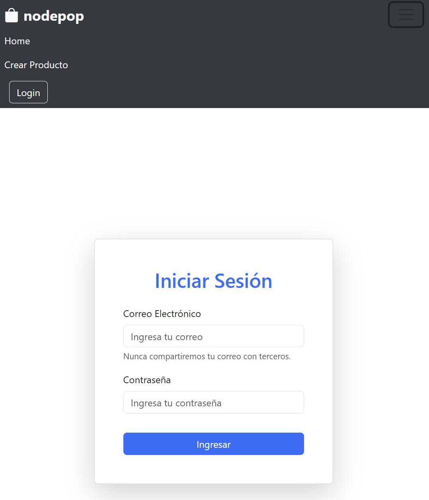

[](README.es.md)
[](README.en.md)


# Nodepop

Nodepop es una aplicación web para la compra y venta de artículos de segunda mano. Permite a los usuarios registrarse, iniciar sesión y gestionar sus productos mediante un sistema de autenticación. Cada usuario puede crear productos con atributos como nombre, precio y etiquetas, y no hay un límite máximo para la cantidad de productos que un usuario puede crear. La aplicación está desarrollada con **Node.js**, **Express**, **MongoDB** y **EJS**.

## Características

- Autenticación de usuarios: Registro, inicio de sesión y cierre de sesión.
- Gestión de productos: Crear, ver y eliminar productos.
- Muestra el Usuario registrado
- Paginacion manual introduciendo el limit&skip manualmente ejm: http://localhost:5555/?limit=5&skip=0
- Filtro por precio MAX ejm: http://localhost:5555/?maxPrice=20 o MIN ejm http://localhost:5555/?minPrice=20
- Busqueda por nombre
- Eliminacion de filtros 
- Opcional: Tags de productos: Cada producto puede tener uno o varios tags (categorías) como `work`, `lifestyle`, `motor` o `mobile`.
- Opcional la creacion de producto con file (Image)
- Internacionalizacion
- No existe un máximo para la cantidad de productos que un usuario puede crear.

## Características del API
### base URL: http://localhost:3000/api
### CRUD:
- Obtencion de lista de productos con metodo GET /products
```json
   {
       "_id": "672fb2ae96dbac14e6740ff1",
       "name": "fridge",
       "price": 150,
       "owner": "672fb2ae96dbac14e6740fe9",
       "tags": [
           "mobile"
       ],
       "__v": 0
   }
```
- Obtencion de producto unico por su _id metodo get /api/products/:productId
- Creacion de productos con o sin imagen y etiquetas. metodo POST /api/products
```json
{
    "result": {
        "name": "apiproductconimagen",
        "price": 55,
        "tags": [
            "work"
        ],
        "_id": "67793a08b8114c9236a181b3",
        "Image": "50a6aaf6c1814be3e5e03399f45af9f9",
        "__v": 0
    }
}
```
- Eliminacion de un producto unico por su _id metodo. Delete /api/products/:productId
- Actualizacion de un producto por _id. metodo Put /api/products:productId

## otros carazteristicas
- Paginacion manual introduciendo el limit&skip manualmente ejm: products/?limit=5&skip=0
- Filtro por precio MAX ejm: /?maxPrice=20 o MIN ejm /?minPrice=20
- Busqueda por nombre /?name=ejemplo
- Busqueda por campo /?fields=name
- Eliminacion de filtros
- Conteo de productos
- 

## Requisitos previos

Asegúrate de tener instalados:

- **Node.js** (versión 14 o superior)
- **MongoDB** (en ejecución en `localhost:27017`)

## Instalación

1. Clona este repositorio:

   ```bash
   git clone https://github.com/Rober040992/Pr-ctica-WEB-Backend-Node.js-MongoDB.git
   cd nodepop
   ```

2. Instala las dependencias:

   ```bash
   npm install
   ```
   - 2.1 en tu primer deploy crear un .env en la root del proyecto y customiza las variables de entorno ejm: MONGO_URI = mongodb://127.0.0.1:27017/nodepop

3. Configura tu base de datos en MongoDB y asegúrate de que esté ejecutándose en `mongodb://127.0.0.1:27017/nodepop`.

## Scripts

En el archivo `package.json`, se han definido varios scripts para facilitar el uso de la aplicación. A continuación, se explica cada uno:

### `npm start`

Inicia el servidor en modo observación (watch mode), reiniciándose automáticamente cuando se detectan cambios en el código. Esto es útil para desarrollo.

```bash
npm start
```

### `npm run dev`

Inicia el servidor en modo desarrollo en el puerto `4444`. Esto es útil para pruebas de desarrollo con un puerto diferente.

```bash
npm run dev
```

### `npm run debug`

Inicia el servidor en modo depuración en el puerto `5555`. Esto es útil para identificar y resolver problemas en el código.

```bash
npm run debug
```

### `npm run initDataBase`

Este script inicializa la base de datos. Te pedirá confirmación para eliminar los datos actuales y crear datos de ejemplo, incluyendo usuarios y productos iniciales.

```bash
npm run initDataBase
```
### crear archivo .env 
Este archvo esta a mode de example en la raiz del proyecto
Simplemente copia el contenido del .example, pegalo en tu nuevo archivo .env y customiza las variables de entrono que se proporcionan dentro de este.

#### Pasos para ejecutar `initDataBase`:

1. Ejecuta el comando `npm run initDataBase`.
2. Se te pedirá que confirmes si deseas vaciar la base de datos y crear datos de prueba. Escribe `yes` y presiona **Enter** para continuar.
3. El script eliminará los usuarios y productos existentes y creará nuevos datos de ejemplo.
4. Los usuarios a usar en el Web site y en la API vienen en el initDB.js
### `npm run lint`

Ejecuta el linter `standard` para comprobar y corregir automáticamente el estilo de tu código según las reglas de JavaScript Standard Style.

```bash
npm run lint
```

## Uso de la Aplicación

1. **Iniciar el servidor**: Una vez instaladas las dependencias, inicia el servidor ejecutando uno de los scripts mencionados (`start`, `dev` o `debug`).

2. **Iniciar sesión**: inicia sesión para acceder a la funcionalidad completa de la aplicación. (usando un user del initDB.js)

3. **Crear productos**: En la página de creación de productos, el usuario autenticado puede agregar productos sin límite de cantidad. Cada producto puede incluir:
   - **Nombre**: Un nombre único para el producto.
   - **Precio**: El precio del producto (en dólares). *No hay un límite máximo para el precio.*
   - **Tags**: Uno o varios tags que describan el producto (`work`, `lifestyle`, `motor`, `mobile`).
   - **Subida de archivos**: opcional subida de archivo tipo Imagen

4. **Ver y eliminar productos**: Los productos creados por el usuario aparecerán en la página de inicio. Desde allí, el usuario puede ver los detalles de cada producto o eliminarlos.

## Estructura del Proyecto

La estructura de directorios de Nodepop es la siguiente:

- **bin**: Contiene el archivo `www`, que inicia el servidor HTTP.
- **config**: Incluye la configuración de conexión a MongoDB (`mongooseConfig.js`) y el manejo de sesiones (`sessionManager.js`).
- **controllers**: Contiene los controladores de las rutas de la aplicación.
- **models**: Define los esquemas de datos para usuarios y productos en MongoDB.
- **public**: Almacena archivos estáticos, como hojas de estilo CSS.
- **views**: Contiene las plantillas EJS para renderizar las páginas de la aplicación.
- **app.js**: Configura la aplicación de Express y define las rutas principales.
- **initDB.js**: Script para inicializar la base de datos con datos de ejemplo.

## Tecnologías Utilizadas

- **Node.js**: Plataforma de backend utilizada para construir la aplicación.
- **Express**: Framework para manejar las rutas y la lógica del servidor.
- **MongoDB**: Base de datos NoSQL para almacenar los datos de usuarios y productos.
- **Mongoose**: ODM (Object Data Modeling) para MongoDB, utilizado para definir y gestionar esquemas de datos.
- **EJS**: Motor de plantillas para renderizar las vistas en HTML.
- **bcrypt**: Para hashear y comparar las contraseñas de los usuarios de forma segura.
- **express-session**: Para gestionar las sesiones de los usuarios en la aplicación.
- **connect-mongo**: Almacenamiento de sesiones en MongoDB.
- **http-errors**: Para crear errores HTTP personalizados y manejarlos en la aplicación.
- **morgan**: Middleware de registro de solicitudes HTTP, útil para depuración y monitoreo.
- **cross-env**: Para definir variables de entorno en los scripts de npm de manera multiplataforma.
- **standard**: Linter para mantener el estilo y la calidad del código.
- **multer**: multipart/form-data permite el manejo de files como la subida.
- **dotenv**: creacion de variables de entorno (contenidas en file .env)
- **i18n**: internacionalizacion de todo el contenido estatico (no de los datos), pluralizacion y selector de idiomas
- **jsonwebtoken**: creacion de JWT para login de user en el API